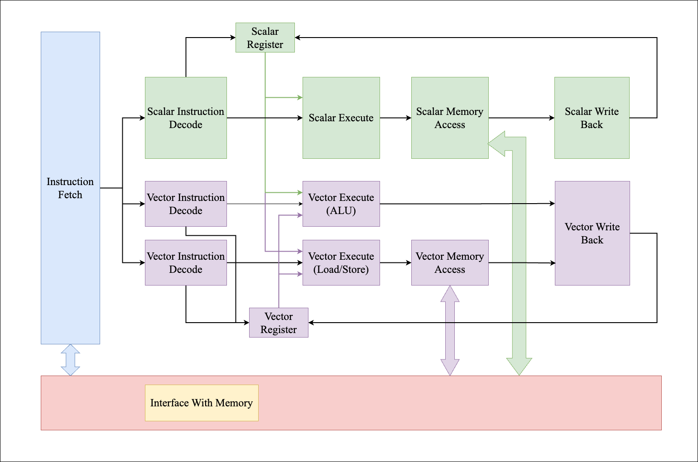
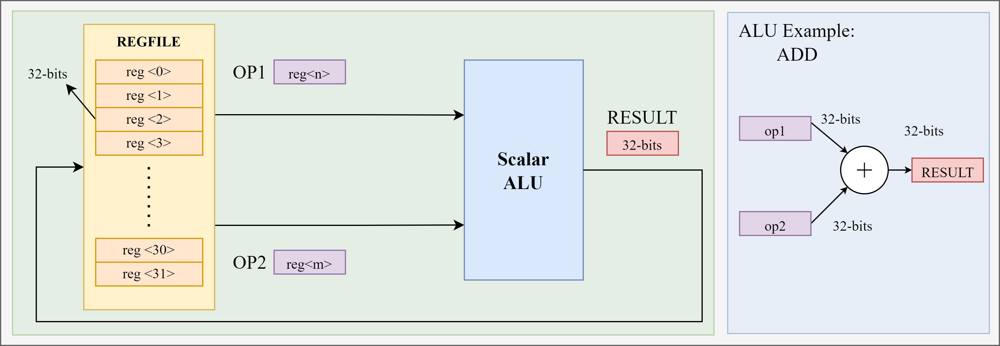
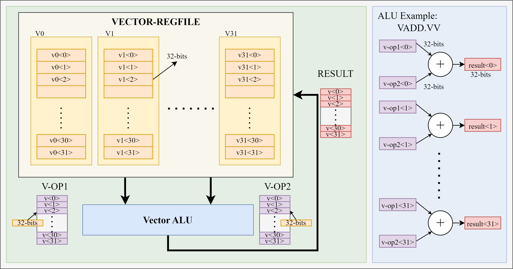
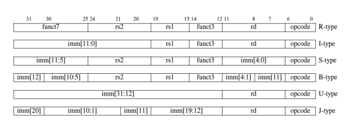
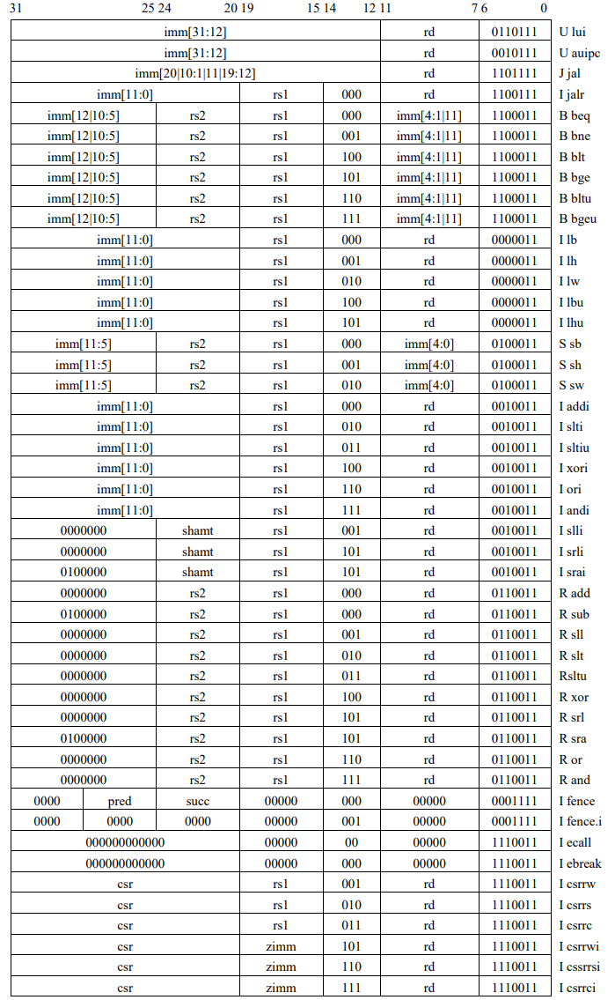
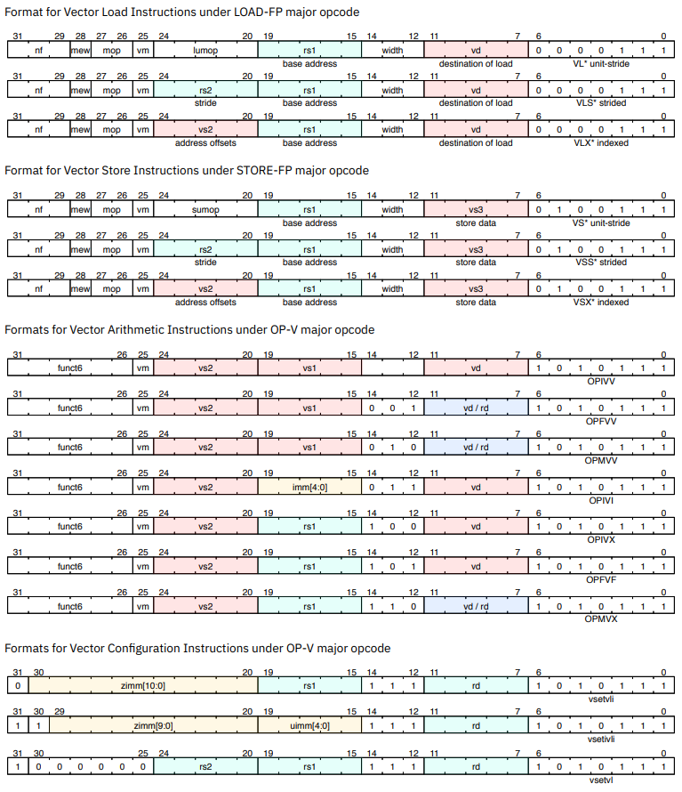
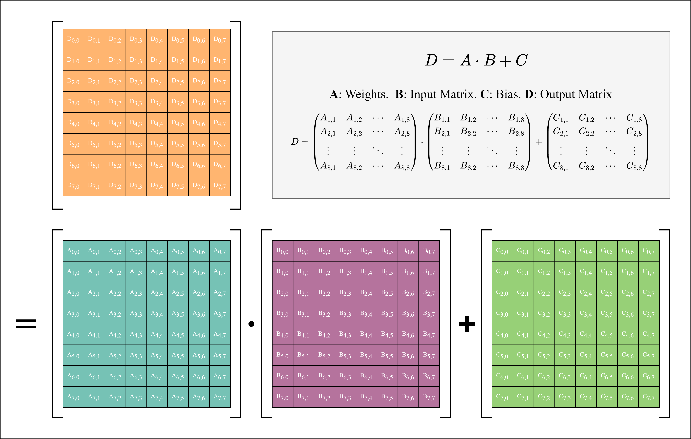
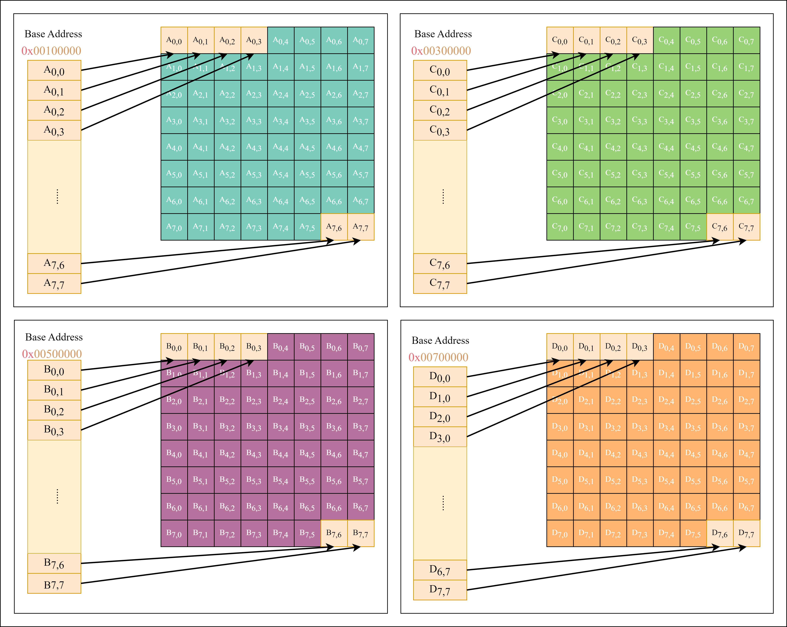
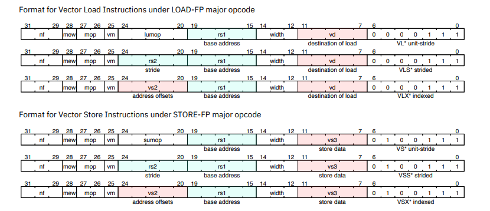
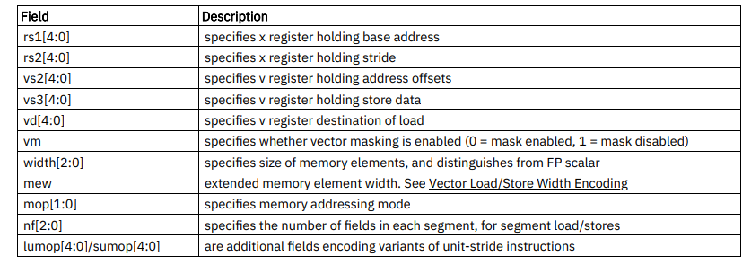

# Lab-4 Design of a RISC-V Processor

## Introduction

The lab aims to design a RISC-V processor supporting MAC (Multiply Accumulate) operation. The lab introduces a multi-issue processor with a scalar datapath and two vector datapaths. By completing the Verilog codes and designing the corresponding assembly codes, you will have a deep understanding of the computer architecture.



## Background

### Vector Processor

We can use **SIMD** to achieve data parallelism. With the rise of applications such as multimedia, big data, and artificial intelligence, it has become increasingly important to endow processors with SIMD processing power. As these applications have a large number of fine-grained, homogeneous, and independent data operations that SIMD is inherently suited to handle.

The structure of a vector processor fits well with the problem of parallel computation of large amounts of data. A vector processor has multiple ALUs that are capable of performing the same operation many times at the same time. The basic idea of the vector architecture is to collect data elements from memory, put them into a large set of registers, then operate on them using a pipelined execution unit, and finally write the result back to memory. **The key feature of vector architecture is a set of vector registers.**

The next picture shows a simplified scalar processor's datapath.



The next picture shows a simplified vector processor's datapath. The scalar operand in scalar architecture is expanded to vector operand in vector architecture. And the relative REGFILE and ALU are also vectorized.



### Vector VS Scalar

In order to visualize the characteristics of vector processors and conventional processors, we provide one case study. We want to use a vector processor and a conventional processor to perform the following operations, respectively.


Here $X$, $Y$, $Z$ are 8-dimensional vectors, and each element of the vector is one 32-bit integer data; $a$ is a 32-bit integer scalar.


The address of $a$ in memory is in register x4, the base address of $X$ in memory is in register x5, the base address of $Y$ in memory is in register x6, and the base address of $Z$ in memory is in register x7.

| variables                       | a  | X  | Y  | Z  |
| ------------------------------- | -- | -- | -- | -- |
| **base address register** | x4 | x5 | x6 | x7 |

#### Scalar Processor

The assembly codes based on the RISC-V instruction set are shown below.

```
    addi    x1,     $zero,  1       ; set x1 = 1
    lw      x11,    0(x4)           ; load scalar a
    addi    x12,    $zero,  8       ; upper bound of what to load
loop:
    lw     x13,    0(x5)           ; load X[i]
    mul     x13,    x13,    x11     ; a x X[i]
    lw      x14,    0(x6)           ; load Y[i]
    add     x14,    x14,    x13     ; a x X[i] + Y[i]
    sw      x14,    0(x7)           ; store Z[i]
    addi    x5,     x5,     4       ; increment index to x
    addi    x6,     x6,     4       ; increment index to y
    addi    x7,     x7,     4       ; increment index to z
    sub     x12,    x12,    x1      ; x12 = x12 - 1
    bne     x12,    $zero,  loop    ; check if done
```

#### Vector Processor

The assembly codes based on the RISC-V Vector-Extension instruction set are shown below.

```
lw         x11,    0(x4)          ; load scalar a
vle32.v    v13,    0(x5)          ; load vector X
vmul.vx    v14,    v13,    x11    ; a x X
vle32.v    v15,    0(x6)          ; load vector Y
vadd.vv    v16,    v14,    v15    ; Z = a x X + Y
sle32.v    v16,    0(x7)          ; store Z
```

#### Comparison

By comparing two assembly code implementations, we can discover that the number of instructions of the vector processor is much less than the number of instructions of the scalar version. This is mainly due to the vector processor's ability to compute multiple data in parallel, eliminating the need to use for loop.


### Multi-Issue Processor

In computer architecture, multi-issue processors enable a processor to launch multiple instructions in a single clock cycle. There are mainly two categories of multi-issue processors: static multi-issue and dynamic multi-issue.

Dynamic multi-issue is implemented in hardware where the processor dynamically decides at runtime which instructions to issue, resolving dependencies and reordering instructions on-the-fly. This approach offers flexibility but adds hardware complexity and power consumption. 

Static multi-issue, on the other hand, relies on the compiler to analyze and schedule instructions. It simplifies hardware but requires sophisticated compiler techniques and can be less adaptable to runtime conditions.

> In this lab, we only focus on the `static multi-issue` processors.

The following figure gives an instruction processing timing diagram for a 2-issue pipelined processor. ALU/Branch instructions and Load/Store instructions can be seen to be processed in parallel at the same time. In order to support this operation, the hardware needs to have separate data paths for each of them.


To help understand the concepts, we rewrite the previous assembly code for a single-issue scalar processor as two-issue assembly code. Note that the code presented on the same line is executable in parallel.

```
    addi    x1,     $zero,  1       ; lw      x11,    0(x4)             ; set x1 = 1 & load scalar a
    addi    x12,    $zero,  8       ; nop                               ; upper bound of what to load
loop:
    nop                             ; lw     x13,    0(x5)              ; load X[i]
    mul     x13,    x13,    x11     ; lw      x14,    0(x6)             ; a x X[i] & load Y[i]
    add     x14,    x14,    x13     ; nop                               ; a x X[i] + Y[i]
    addi    x5,     x5,     4       ; sw      x14,    0(x7)             ; increment index to x & store Z[i]
    addi    x6,     x6,     4       ; nop                               ; increment index to y
    addi    x7,     x7,     4       ; nop                               ; increment index to z
    sub     x12,    x12,    x1      ; nop                               ; x12 = x12 - 1
    bne     x12,    $zero,  loop    ; nop                               ; check if done
```

### RISC-V

RISC-V is an open-source instruction set architecture (ISA) based on the principles of Reduced Instruction Set Computing (RISC), with V denoting the fifth generation of RISC.

RISC-V instruction set includes RV32I and RV32M, RV32F, RV32D, RV32A, RV32V extensions. The instruction set RV32I is a fixed basic integer instruction set. RV32V is the vector extension.

In this lab, RV32I, RV32M and RV32V  instruction sets are used.

#### RV32I

The following figure shows six basic instruction formats of RV32I:

1. R-type instructions for register-register operations
2. I-type instructions for short immediate and load operations
3. S-type instructions for store operations
4. B-type instructions for conditional jump operations
5. U-type instructions for long immediate
6. J-type instructions for unconditional jumps



The following figure shows the instructions of each type in RV32I.



#### RV32M

RV32M adds integer multiplication and division instructions to RV32I, including instructions for signed and unsigned integers, divide (div) and divide unsigned (divu), which put the quotient into the target register. In a few cases, the programmer needs the remainder rather than the quotient, so RV32M provides
remainder (rem) and remainder unsigned (remu), which writes the remainder to the target register instead of the quotient.

To correctly obtain a signed or unsigned 64-bit product, RISC-V comes with four multiplication instructions. To get the integer 32-bit product (the lower 32 bits of 64 bits) use the mul instruction. To get the high 32 bits, use the mulh instruction for signed operands, the mulhu instruction for unsigned operands and the mulhsu instruction for signed multiplier and unsigned multiplicand.


#### RV32V

The opcodes of the instructions in the vector extension either are the same as LOAD-FP and STORE-FP or use OP-V.



| Category | operation                | Operands         | Type of scalar operand                               |
| -------- | ------------------------ | ---------------- | ---------------------------------------------------- |
| OPI-VV   | integer operation        | vector-vector    | N/A                                                  |
| OPF-VV   | floating-point operation | vector-vector    | N/A                                                  |
| OPM-VV   | mask operation           | vector-vector    | N/A                                                  |
| OPI-VI   | integer operation        | vector-immediate | `imm[4:0]`                                         |
| OPI-VX   | integer operation        | vector-scalar    | GPR(general purpose registers)`x` register `rs1` |
| OPI-VF   | integer operation        | vector-scalar    | FP `f` register `rs1`                            |
| OPM-VX   | mask operation           | vector-scalar    | GPR `x` register `rs1`                           |

> In this lab, we only focus on the `OPIVV`, `OPIVI` and `OPIVX`.

## Lab Goals

The purpose of the lab is to design a multi-issue RISC-V processor, which can perform the MAC operation. The expected operation is shown below. The dimensions of all matrices are 8 by 8 and each element in the matrices is a 32-bit data. Matrix-A is the weight matrix. Matrix-B is the input matrix. Matrix-C is the bias matrix. Matrix-D is the output matrix.

> For simplicity, we assume no data overflow will occur.



## Lab Setup

### Data Mapping

The mapping of the data of the matrix to the addresses of the memory are shown in the following figures. For all the matrixes involved, we provide two ways of data mapping.

One is to store the matrices in row-major.



The other is to store the transposed matrices in column-major.


The base address is the first element's address of the data block. The detailed base address information is shown below.

| **Data** | **Base Address** |
| -------------- | ---------------------- |
| Instructions   | 0x80000000             |
| Matrix-A       | 0x80100000             |
| Matrix-A.T     | 0x80200000             |
| Matrix-B       | 0x80300000             |
| Matrix-B.T     | 0x80400000             |
| Matrix-C       | 0x80500000             |
| Matrix-C.T     | 0x80600000             |
| Matrix-D       | 0x80700000             |
| Matrix-D.T     | 0x80800000             |

### Memory Interface

To reduce the challenge of accessing memory, we use 3 simplified memory access models.

> **Caution** : The memory interface has been greatly simplified here to reduce the difficulty of the experiment. The memory can read out data in one clock cycle (processor clock) during simulation. But in practice, the memory's read and write speed are much lower than the processor's main frequency. In addition, the memory and the processor are often connected through the bus, and instruction storage and data storage do not necessarily use two sets of read-out interfaces. Thus, the processor needs to arbitrate whether to read data or the instructions.

In this lab, the INST_RAMHelper is used to get the instructions from the memory.

```verilog
module INST_RAMHelper(
  input         clk,
  input         ren,    // read enable 
  input  [31:0] raddr,  // read address
  output [31:0] rdata   // read data
);
```

The SCALAR_RAMHelper is used to get the scalar data from the memory.

```verilog
module SCALAR_RAMHelper(
  input         clk,
  input         ren,    // read enable 
  input  [31:0] raddr,  // read address
  output [31:0] rdata,  // read data
  input         wen,    // write enable 
  input  [31:0] waddr,  // write address
  input  [31:0] wdata,  // write data
  input  [31:0] wmask   // write mask
);
```

The Vector_RAMHelper is used to get the vector data from the memory.

```verilog
module VECTOR_RAMHelper(
  input          clk,
  input          ren,    // read enable 
  input  [31 :0] raddr,  // read address
  output [255:0] rdata,  // read data
  input          wen,    // write enable 
  input  [31 :0] waddr,  // write address
  input  [255:0] wdata,  // write data
  input  [255:0] wmask   // write mask
);
```

### Data Access

The minimum stride of access memory is 1 Byte (8 bits).

**For 32-bit data access, the access address's step is 4.** For example, data A and data B are both 32-bit data and stored in adjacent locations. Data A's address is 0x0000_1000 and data B's address is 0x0000_1004.

### RISC-V Vector Extension

#### Vector Data Width Setting

The vector extended RISCV processor contains 32 vector registers, `x0-x31`.

`VLEN`: represents a fixed bit width for each vector register.

`SEW`: represents the bit width of the selected vector element. It is controlled by register vsew[2:0].

Taking `VLEN=128bits` as an example, the correspondence between the number of elements contained in each vector register and `SEW` is shown in the following table.

| **VELN** | **SEW** | **Elements Per Vector Register** |
| :------------: | :-----------: | :------------------------------------: |
|      128      |      64      |                   2                   |
|      128      |      32      |                   4                   |
|      128      |      16      |                   8                   |
|      128      |       8       |                   16                   |

`LMUL`: represents the vector length multiplier. If greater than 1, it represents the default number of vector registers.

`VLMAX`: represents the maximum number of vector elements that a vector instruction can operate on. `VLMAX=LMUL*VLEN/SEW`.

***!!! IMPORTANT !!!***

**To simplify the experiment, we set all the above parameters to fixed values.**


#### Mask Setting

In the arithmetic and access instructions, you can choose whether to use the mask or not, and whether to enable the function is controlled by the vm bit in the instruction.

***!!! IMPORTANT !!!***

In this experiment, the mask is not used by default. **And **`vm`** is set to 1 in all instructions to disable the mask function.**

#### Load/Store Setting

There are 3 different access modes for RISC-V vector extensions: **unit-stride, strided, indexed** .

The `unit-stride` operation accesses consecutive elements stored in memory starting at the base effective address.

The `strided` operation accesses the first memory element at the base effective address, and then accesses subsequent elements at the address increment given by the byte offset contained in the x register specified by rs2.

The `indexed` operation adds the vector offset specified by rs2 to the base effective address to obtain the effective address of each element.

The following images describe the format of the access command and its specific meaning.





***!!! IMPORTANT !!!***

In order to simplify the experiment, this experiment **only needs to support the access mode of  **`unit-stride`** . In addition, the  **`nf`** ,  **`mew`** ,  **`mop`** , and **`lumop`** bits of the access instruction can be set to the default value of 0.**

### Assembly Code

The assembly code needs to be translated into machine code by the translator in order to be recognized and executed by the processor. A simple translator is provided in the experimental environment to translate the assembly code into a bin file. Using this translator requires the assembly code to be written in the specified format.

If you are not familiar with the assembly code, you can try to use the RISC-V assembler and runtime simulator.

> [TheThirdOne/rars: RARS -- RISC-V Assembler and Runtime Simulator (github.com)](https://github.com/TheThirdOne/rars)

The file `demo.asm` in the asm folder shows an example code that calls all the used instructions in the lab. Please refer to the format of this code to write assembly code.

The scalar registers' names are `x0-x31`. And `x0` can be replaced with `zero`.

The vector registers' names are `vx0-vx31`. And `vx0` can be replaced with `vzero`.

```
; =======================================
; scalar instructions
; =======================================

; load matrix_A base-address 0x80100000 to the register x5 
; ( the immediate number is already shifted 12-bits here )
lui     x5,     2148532224          ; x5 = 0x80100000

addi    x6,     x5,     4           ; x6  = x5+4
lw      x7,     0(x5)               ; x7  = A[0][0]
lw      x8,     4(x6)               ; x18 = A[0][2]

slti    x9,     x7,     64          ; x9 = (x7<64)
addi    x9,     zero,   1           ; x9  = 1 
add     x10,    x9,     x9          ; x10 = x9+x9 
and     x11,    x10,    x9          ; x11 = x10 & x9 
mul     x12,    x10,    x10         ; x12 = x10 * x10 
sll     x13,    x9,     1           ; x13 = x9<<1 

addi    x9,     zero,   4           ; assign 4 to x9
addi    x10,    zero,   0           ; assign 0 to x10 
loop:   
addi    x10,    x10,    1           ; assign x10+1 to x10 
mul     x12,    x12,    x10         ; assign x12*x10 to x12 
blt     x10,    x9,     loop        ; if( x10<x9 ) jump to loop

sw      x12,    0(x5)               ; A[0][0] = x12 
jal     x1,     label               ; jump to label 

; =======================================
; vector instructions
; =======================================
label:
vle32.v vx2,    x5,     1           ; vx2 = A[0][0:7]

vadd.vi vx3,    vzero,  1   ,   1   ; vx3[i] = 1
vadd.vx vx3,    vzero,  x12 ,   1   ; vx3[i] = x12
vmul.vv vx4,    vx2,    vx3 ,   1   ; vx4[i] = vx2[i] * vx3[i]

vse32.v vx4,    x5,     1           ; A[0][0:7] = vx4 


```

## Detailed Tasks

### Task1.1 - Single-Issue Processor

You need to complete the instructions in the table below and pass the test. Here `sext` means `signed extended` and `Mem` means `Memory`. The logic operation (`and`) is bit-wise.

| Type | Instruction | Format               | Implementation                          |
| ---- | ----------- | -------------------- | --------------------------------------- |
| R    | mul         | mul rd, rs1, rs2     | x[rd] = x[rs1] * x[rs2]                 |
| R    | add         | add rd, rs1, rs2     | x[rd] = x[rs1] + x[rs2]                 |
| R    | and         | and rd, rs1, rs2     | x[rd] = x[rs1] & x[rs2]                 |
| R    | sll         | sll rd, rs1, rs2     | x[rd] = x[rs1] << x[rs2]                |
| I    | addi        | addi rd, rs1, imm    | x[rd] = x[rs1] + sext(immediate)        |
| I    | slti        | slti rd, rs1, imm    | x[rd] = x[rs1] < sext(immediate)        |
| I    | lw          | lw rd, offset(rs1)   | x[rd] = Mem[x[rs1] + sext(offset)]      |
| S    | sw          | sw rs2, offset(rs1)  | Mem[x[rs1] + sext(offset)] = x[rs2]     |
| B    | blt         | blt rs1, rs2, offset | if (x[rs1] < x[rs2]) pc += sext(offset) |
| U    | lui         | lui rd,imm           | x[rd] = immediate[31:12] << 12          |
| J    | jal         | jal rd,offset        | x[rd] = pc+4; pc += sext(offset)        |

> To better understand the meaning of these instructions, you can refer to [this](https://msyksphinz-self.github.io/riscv-isadoc/html/rvi.html).

> To get the corresponding instruction format, you can refer to [this](#rv32i).

> The code templates have been provided for the implementation of several instructions.

> HINT: Finish the modules under /src/vsrc/components/single_issue. Top module (/src/vsrc/rvcpu/rvcpu_single_issue.v) is already given.

### Task1.2 - Assembly Code 1

After completing Task 1.1, we have been able to use these instructions to perform some useful computation. Now, use these instructions to complete the [MAC](#lab-goals) Operation.

> HINT: Finish the code in /src/asm/task1_2.asm.

### Task2.1 - Two-Issue Processor

Extend the scalar processor to a two-issue processor, with one datapath supporting scalar and another supporting vector operations. For vector operations, you need to complete the instructions in the table below and pass the test.

| Type  | Instruction | Format                   | Implementation          |
| ----- | ----------- | ------------------------ | ----------------------- |
| LOAD  | vle32.v     | vle32.v vd, rs1, vm      | vd = Mem[x[rs1]]        |
| STORE | vse32.v     | vse32.v vs3, rs1, vm     | Mem[x[rs1]] = vs3       |
| OPIVV | vadd.vv     | vadd.vv vd, vs2, vs1, vm | vd[i] = vs2[i] + vs1[i] |
| OPIVI | vadd.vi     | vadd.vi vd, vs2, imm, vm | vd[i] = vs2[i] + imm    |
| OPIVX | vadd.vx     | vadd.vx vd, vs2, rs1, vm | vd[i] = vs2[i] + x[rs1] |
| OPIVV | vmul.vv     | vmul.vv vd, vs2, vs1, vm | vd[i] = vs2[i] * vs1[i] |
| OPIVI | vmul.vi     | vmul.vi vd, vs2, imm, vm | vd[i] = vs2[i] * imm    |
| OPIVX | vmul.vx     | vmul.vx vd, vs2, rs1, vm | vd[i] = vs2[i] * x[rs1] |

The formats of relative instructions are shown below.

| Instruction | Format                                                                                                                                                                                 |
| ----------- | -------------------------------------------------------------------------------------------------------------------------------------------------------------------------------------- |
| `vle32.v` |                                                                                                                                          |
| `vse32.v` |                                                                                                                                          |
| `vadd.vv` |                                                                                                                                          |
| `vmul.vv` |                                                                                                                                          |
| other       | `vadd.vi`, `vadd.vx`, `vmul.vi`, and `vmul.vx`  only need to modify the `funct3`.<br />For `OPIVI`, the `funct3` is `011`. For `OPIVX`, the `funct3` is `100.` |

> HINT: Finish the modules under /src/vsrc/components/two_issue and /src/vsrc/rvcpu/rvcpu_two_issue.v.

### Task2.2 - Assembly Code 2

Vector processors can handle [MAC](#lab-goals) operations more efficiently. Now, use the vector instructions to do this operation.

***Note that you are only allowed to use instructions from the instruction set RV-32I and RV-32V. In other words, you are not allowed to use the `mul` instruction from RV-32M.***

> HINT: Finish the code in /src/asm/task2_2.asm.

### Task3.1 - Three-Issue Processor

Split the datapath of the processor of Task2.1 into a three-issue processor with one scalar datapath, one vector alu datapath and one for vle and vse. Please refer to the figure of the top arhictecure at the beginning.

> HINT: Finish the modules under /src/vsrc/components/vector_issue and /src/vsrc/rvcpu/rvcpu_three_issue.v.

### Task3.2 - Assembly Code 2

Rewrite the assembly code to adapt it to a three-issue processor.

> HINT: Finish the code in /src/asm/task3_2.asm.

## Simulation Environment

### File Tree

```
|-- build             --Folder containing the simulation files
|-- src
    |-- asm           --Folder containing the assembly codes
    |-- csrc          --Folder containing the cpp files
    |-- vsrc          --Folder containing the verilog codes
|-- tools             --Folder containing the python scripts
|-- Makefile
```

### Make Command

Run the simulation and test. `IMG` is your assembly code name. `ISSUE_NUM` determines the issue number (1 for Task1.x, 2 for Task2.x, 3 for Task3.x).  You can modify the parameter `IMG` and `ISSUE_NUM` in `Makefile` or in your commands.

```
make run IMG=task1_2 ISSUE_NUM=1
make run IMG=task2_2 ISSUE_NUM=2
```
> HINT: You can check your answer of Task x.1 by setting IMG = Taskx_1 and Task x.2 by setting IMG = Taskx_2.


There are 2 ways to clean the built files.

```
make clean # reserve the vcd file
make clear # clean all files in build_test
```

## Grading

The total score (100%) is the sum of code (100%). Besides, you need to finish the content in `answer.sh`.

### Code (100%)

* Task1 (30%)
  * Task1.1 (15%)
  * Task1.2 (15%)
* Task2 (30%)
  * Task2.1 (20%)
  * Task2.2 (10%)
* Task3 (40%)
  * Task3.1 (20%)
  * Task3.2 (20%)


## Submission

Pack your lab4 folder and rename it with a new name `StudentNumber_StudentName_Lab4.zip`, and submit to Blackboard. The file structure should be like this.

```
12345678_张三_Lab4.zip
```

## Reference Link

1. A reference video for last year's Lab4 is uploaded via bb.

2. [RISC-V 手册 一本开源指令集的指南](http://riscvbook.com/chinese/RISC-V-Reader-Chinese-v2p1.pdf)

3. [The RISC-V Instruction Set Manual Volume I: Unprivileged ISA](https://riscv.org/wp-content/uploads/2019/12/riscv-spec-20191213.pdf)

4. [riscv-card](https://github.com/jameslzhu/riscv-card/blob/master/riscv-card.pdf)

5. [RV32I, RV64I Instructions](https://msyksphinz-self.github.io/riscv-isadoc/html/rvi.html)

6. [RISCV-V Online Doc](https://github.com/riscv/riscv-v-spec/blob/master/v-spec.adoc)

7. [RISCV-V Document Pdf](https://github.com/riscv/riscv-v-spec/releases/download/v1.0/riscv-v-spec-1.0.pdf)
